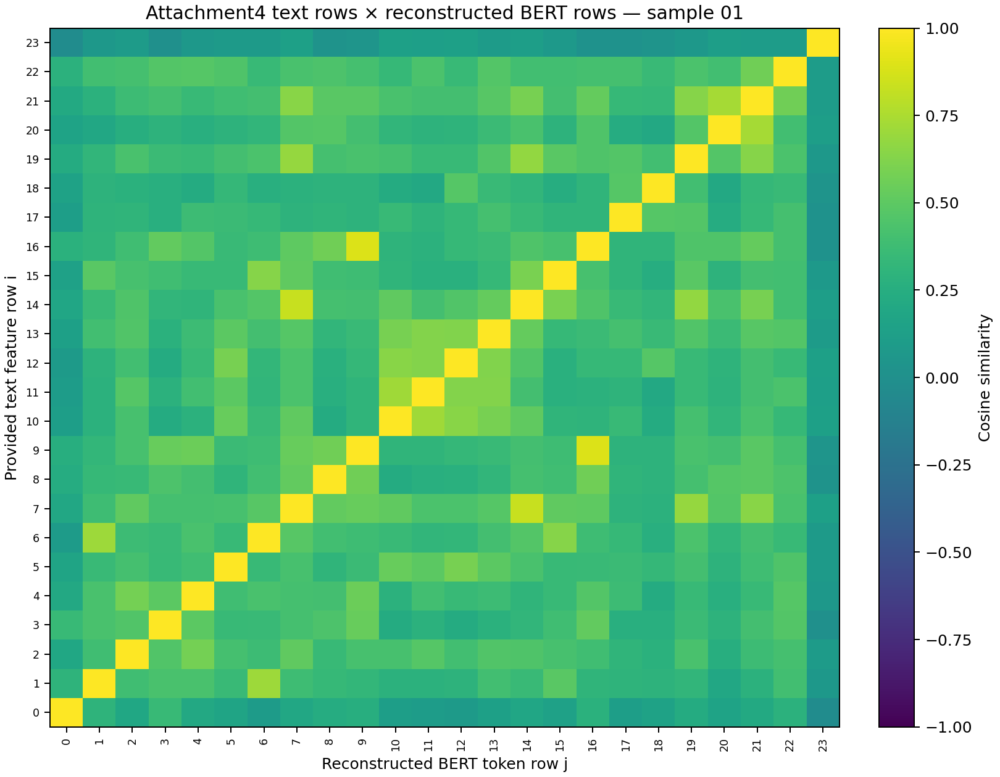

# Q3-2.6 Text Feature Row Identity Audit

**Result: `TEXT_FEATURE_ROW = VERIFIED`**  
**Grounding status: `PARTIAL_GROUNDING_READY`**

This audit addressed the last text-specific blocker: whether an Attachment4 text feature row is the contextual BERT state for the `text_bert` token at the same index. It read 20 aligned Attachment4 samples for this provenance check only. It did not load P2, use HEAF outputs, read labels, train, tune, or run final explanations.

## Candidate selected from public preprocessing code

The reviewed MMSA `BertTextEncoder`, Self-MM `DataPre.py`, and MMSA-FET BERT extractor all instantiate `BertModel` from `bert-base-uncased` and return the final token-level hidden output (`output[0]` or `last_hidden_state`) directly. They add `[CLS]` and `[SEP]` and do not pool or average layers. No public-source-supported alternative transformation was found, so no hidden-layer or layer-average search was run.

Candidate used: `bert-base-uncased`, revision `86b5e0934494bd15c9632b12f734a8a67f723594`, `model.safetensors` SHA256 `68d45e234eb4a928074dfd868cead0219ab85354cc53d20e772753c6bb9169d3`. Hugging Face `from_pretrained` instantiated in eval mode in this run; the audit also explicitly asserted `eval()` and used `no_grad()`. Inputs came from the already-provided `text_bert` IDs and token-type IDs; only the valid prefix was passed, retaining `[CLS]` and `[SEP]`.

## Numerical evidence

Across 20 samples and 604 valid token rows:

| Diagnostic | Result |
|---|---:|
| Same-index full-matrix cosine argmax | 604 / 604 rows |
| Mean same-index cosine | 0.999999994 |
| Mean best off-diagonal cosine | 0.690571460 |
| Mean diagonal margin | 0.309428544 |
| Maximum absolute feature difference | 3.0041 × 10⁻⁵ |
| Row-weighted RMSE | 8.3977 × 10⁻⁷ |

The reconstructed final-layer vectors match the provided vectors to float32 numerical precision, with a clear same-index diagonal in the complete row-to-row cosine matrices. Combined with the public preprocessing path and exact existing token-ID/mask/type-ID reproduction, this supports the mapping `text[i] ↔ text_bert token slot i`.

The public code does not pin the historical BERT checkpoint revision used to create Attachment4. That limits the checkpoint provenance claim; it does not change the verified ordering of rows in the token sequence.

## Grounding state

- **Text: `VERIFIED`.** `evidence_grounding.py` now joins feature slot → token slot → pinned tokenizer offset → raw text character span. Special tokens do not produce a fabricated text fragment.
- **Audio: `UNVERIFIED`.** No time mapping established here.
- **Vision: `UNVERIFIED`.** No frame/time mapping established here.
- **Overall: `PARTIAL_GROUNDING_READY`.** Text evidence can be grounded; audio/video remain withheld unless separately verified.

## Diagnostic figure

This is a provenance diagnostic, not a paper main figure.

## Reproduction artifacts

- Full machine-readable results: [q3_text_row_identity.json](q3_text_row_identity.json)
- Full 20-sample cosine matrices: [row_cosine_matrices.npz](../../experiments/q3/exp_0026_text_row_identity/row_cosine_matrices.npz)
- Per-sample formal experiment metrics: [metrics.json](../../experiments/q3/exp_0026_text_row_identity/metrics.json)
- Reproduction script: [run_q3_text_row_identity.py](../../scripts/run_q3_text_row_identity.py)
- Public extraction sources are recorded with immutable commit URLs in the JSON.

No full Attachment4 HEAF run, final explanation card, or media review was performed.
